# Android-CAI

##  项目简介

一款“美食App”——让你吃到嗨！

全国美食精品荟萃，集聚八大菜系，川鲁粤苏浙闽湘徽，从家常菜到人气料理，从正餐到甜点，从满汉全席到养生汤。搜索美食智慧，品评美食文化，体会美食乐趣。菜，简单的名字，幸福的滋味！海量不同菜系菜谱，满足您的个性化需求

风味民肴，特色食材，独家匠艺！各种美食，随心所享！让你体验前所未有的爆炸口感！

## Logo

设计者:李奥博

## 团队成员

* 赵云峰（开发工程师、测试工程师、组长）
    * Email :1546419171@qq.com
    * GitHub:[https://github.com/zhaoyunfeng123](https://github.com/zhaoyunfeng123)
* 李奥博（产品经理、UI设计师、开发工程师、副组长）
    * Email :1654lab@foxmail.com
    * GitHub:[https://github.com/1062212300](https://github.com/1062212300)
 * 杨时雨（UI设计师、开发工程师、测试工程师）
    * Email :yangsy823@outlook.com
    * GitHub:[https://github.com/speedwind7](https://github.com/speedwind7)
* 孟乐乐（开发工程师）
    * Email :2515854955@qq.com
    * GitHub:[https://github.com/menglele](https://github.com/zhaoyunfeng123/project)
* 刘宇豪（测试工程师）
    * Email :1403949014@qq.com
    * GitHub:[https://github.com/wujiel](https://github.com/wujiel)
* 刘浩（开发工程师、测试工程师）
    * Email :1535910050@qq.com
    * GitHub:[https://github.com/liuhao1202](https://github.com/liuhao1202)

## 项目图册

### 开机动画

### 主页

  
  
  
  
  

### 分类页面

  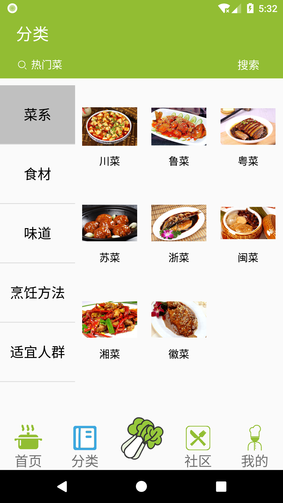
  
  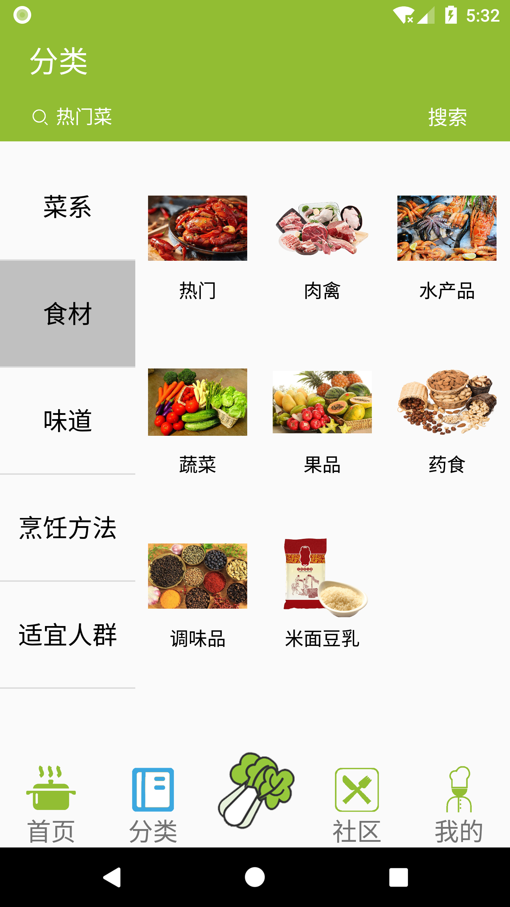
  
  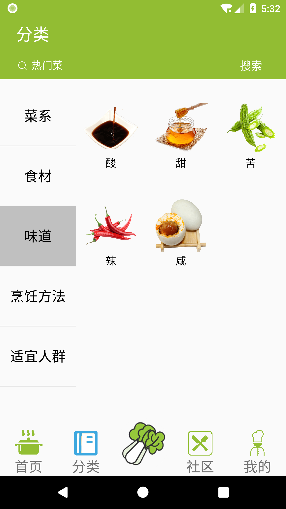

  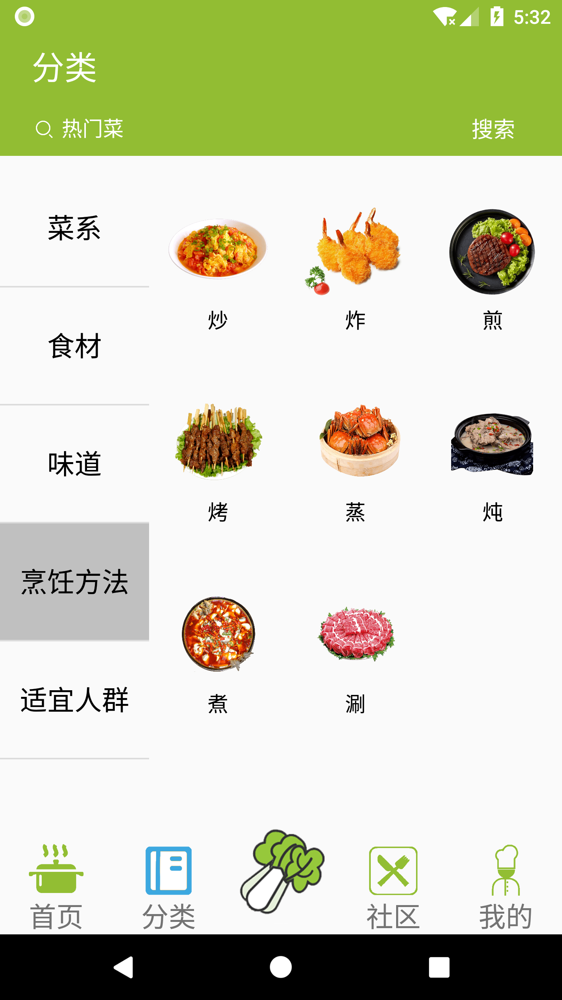

  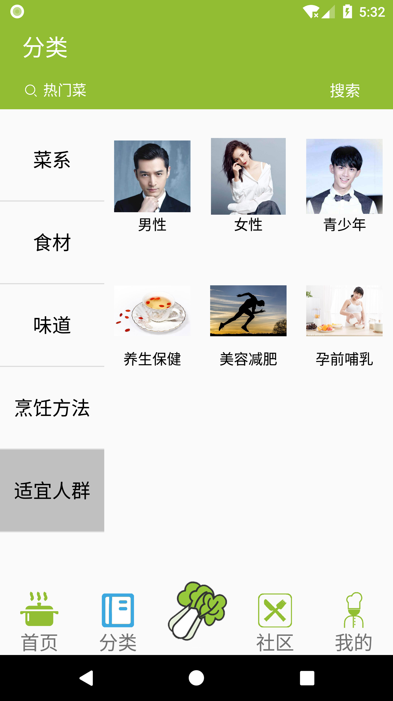

### 精品菜谱页面

  
  
  

### 社区页面

  
  
  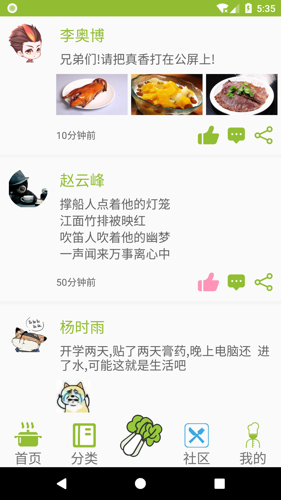
  
  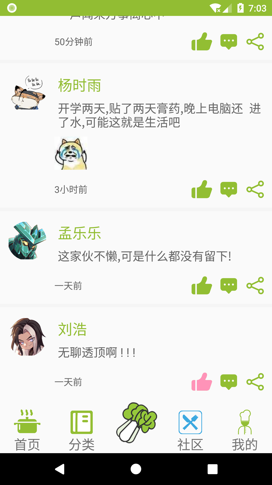

### 我的页面

  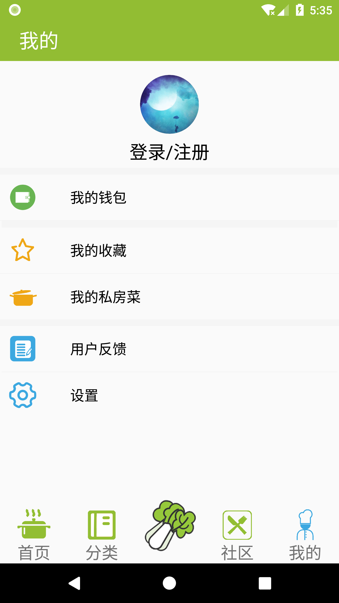
  
  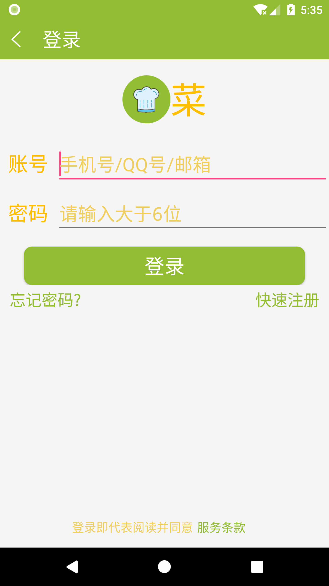
  
  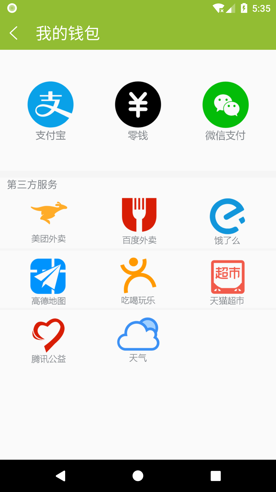

  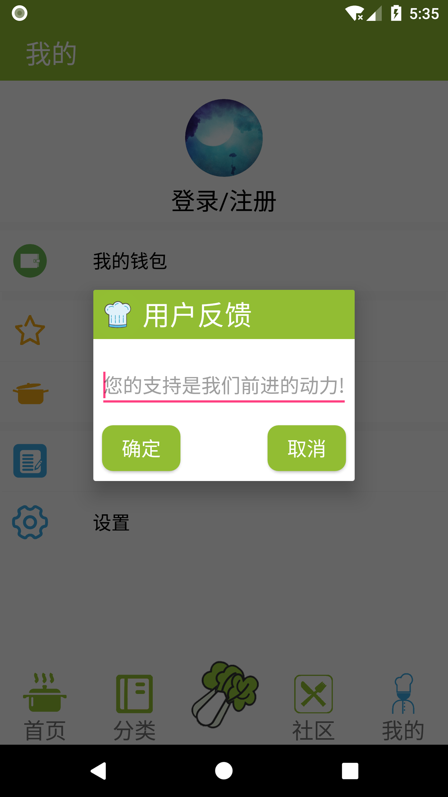
  
  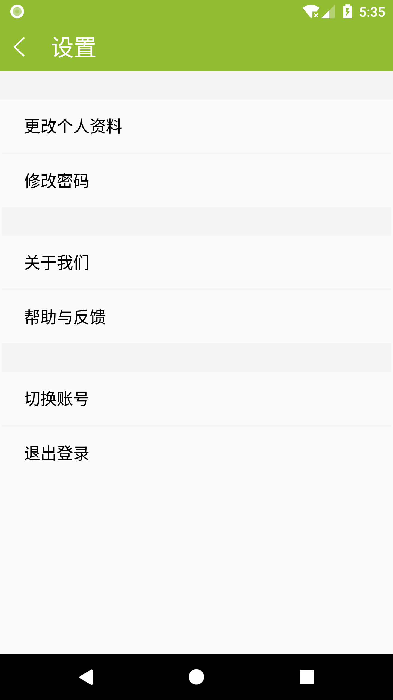
  
   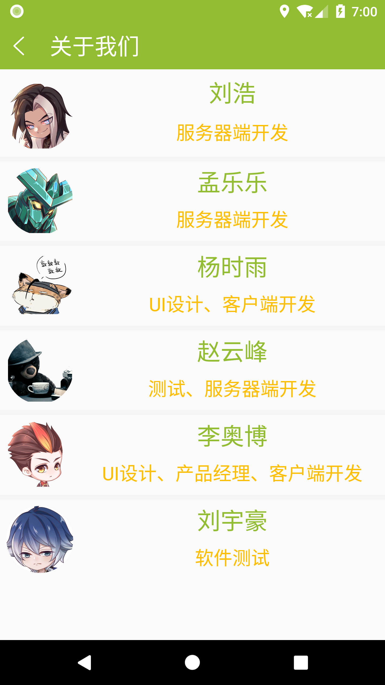

## 补充

* 具体客户端、服务器端代码请到https://github.com/1062212300
  * QQ:1062212300
  * Email:1654lab@foxmail.com
* 感谢观看！

